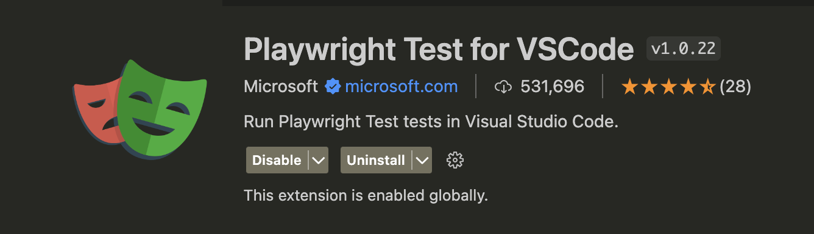
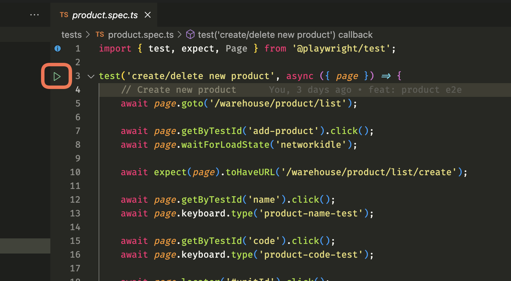

# Introduction to Writing Tests Using Playwright

[Playwright](https://playwright.dev/) is a Node.js library to automate Chromium, Firefox, and WebKit with a single API. It enables cross-browser web automation that is ever-green, capable, reliable, and fast.

## Installation

* Install Playwright using the following command:
```bash
npm install -D @playwright/test
```

* Install Playwright VSCode Extension [Link](https://marketplace.visualstudio.com/items?itemName=ms-playwright.playwright)


## How to Write Tests

1. Create a new file with the `.spec.ts` extension.
2. Import the necessary modules.
3. Write the test cases.

-   Example: follow `product.spec.ts` file in the `tests` directory.

## How to Run Tests

Open test file and click on the `Run Test` button on the top right corner of the test suite.

